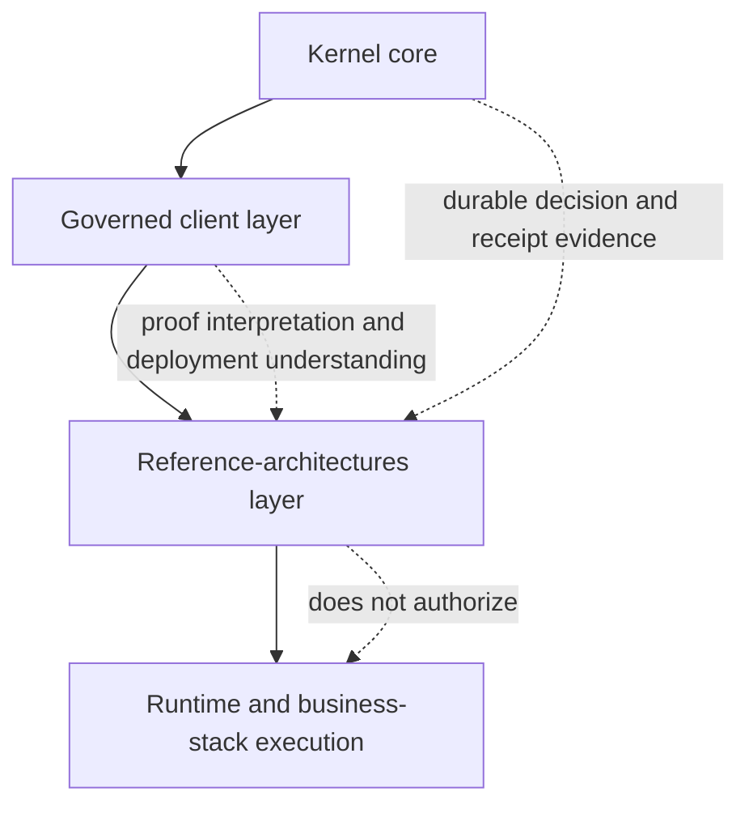

# Topology and Boundary

[Back to README](../README.md)

## Purpose

This page explains the role of the `cosmocrat-reference-architectures`
surface inside the wider Cosmocrat product boundary.

It is a reader-facing explanation layer. It is not a runtime surface, an
operator surface, or a delivery plan.

## Boundary Overview

Cosmocrat is the governed control-plane product around a narrow kernel.

The same boundary can be read visually like this:

At the highest level, the product boundary can be read as four adjacent
layers:

1. **Kernel core**
   - receives a governed proposal
   - evaluates policy and authority
   - returns an adjudicated decision
   - records durable receipt evidence
2. **Governed client layer**
   - proposes mutations to the kernel
   - verifies the returned decision and receipt evidence
   - executes only after valid authorization
3. **Reference-architectures layer**
   - explains topology, packaging, proof, and deployment shape
   - makes the proof posture legible to buyers and reviewers
   - clarifies where product boundaries stop
4. **Runtime and business-stack execution**
   - performs real operational work after authorization
   - remains outside this surface

## What Belongs Here

The reference-architectures surface may contain documentation-class
reference assets such as:

- topology narratives
- boundary maps
- deployment and composition explanations
- reference environment patterns
- proof-line explanations
- linked supporting inputs that remain outside owned content

These materials exist to improve understanding of the product surface,
not to operate environments.

## What Does Not Belong Here

The following remain outside this surface:

- kernel logic or kernel semantic changes
- governed client implementation
- runtime execution assets
- Docker or Kubernetes operational assets
- operator dashboards or control surfaces
- policy-pack content
- SDK or contracts enactment
- memory-governance implementation
- business logic

Nothing on this page implies repo movement, runtime migration, or Stage F
pull-forward.

## Why This Surface Exists

The reference-architectures lane exists because product understanding and
proof comprehension need a stable explanatory layer between governance
canon and runtime execution.

This layer helps a reader answer:

- what Cosmocrat is
- what the deployable proof posture looks like
- how the proof line should be read
- where Cosmocrat stops and runtime begins

## Source

Merged canon inputs from `OrionArchitekton/orion-estate-audit`:

- `architecture/COSMOCRAT_STAGE_E_REFERENCE_ARCHITECTURES_NOTE_20260313.md`
- `architecture/COSMOCRAT_STAGE_C_ARCHITECTURE_COMPANION_20260312.md`
- `architecture/COSMOCRAT_STAGE_E_REFERENCE_ARCHITECTURES_PACKAGE_MAP_20260313.md`
